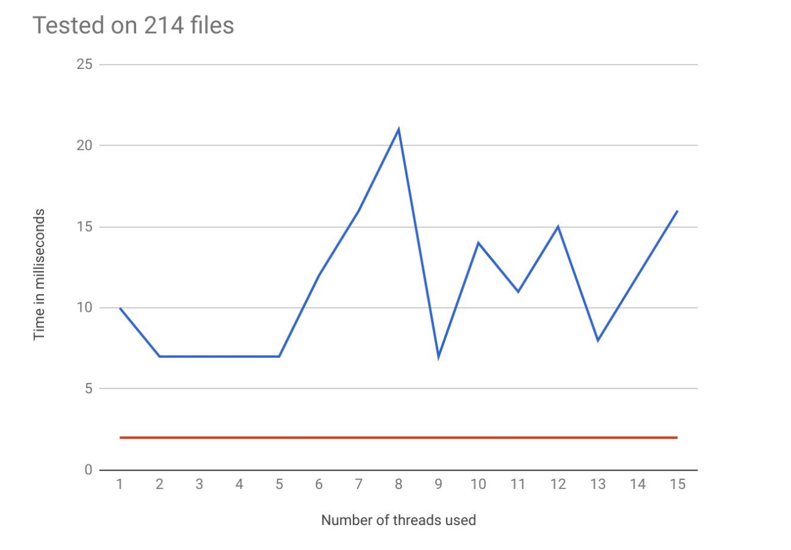
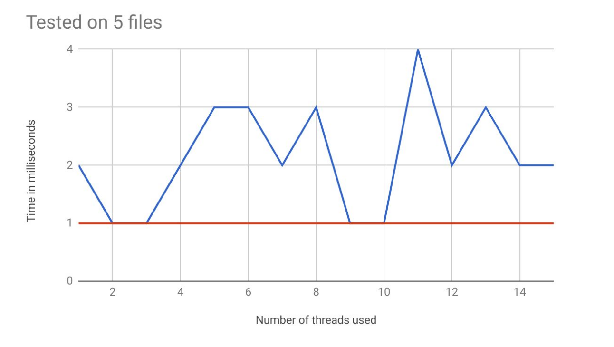

# File-Reader
A program in C that given any list of files can display statistics of all the files such readability, directories, total byte size, and total time of computation.

The input of the program is any file name or many. They can be pipelined throught the terminal with the unix commands.

The output of the program is to print out the following information:
- total number of “bad files.” These are file names causing stat() to return an error.
- total number of directories.
- total number of “regular” files. These are non-directory and non-special files. Most files are of this type.
- total number of “special” files. There are three types—block, character and fifo. If a file is not a directory or a regular file then it is a special file. For example files in the directory /dev/ are often special types of files as they refer to devices.
- total number of bytes used by regular files. 
- total number of regular files that contain all text.
- total number of bytes used by text files.

## To run the program

First in order to make the program, once you are in the same directory with all the files type in the terminal:

> make

### Example Input

> ls -1d /dev/* | ./FileReader

### Example Output
```
Bad Files: 0

Directories: 3

Regular Files: 3

Special Files: 140

Regular File Bytes: 32881

Text Files: 2

Text File Bytes: 16541
```

In the serial architecture version the program (the default), the program will read one file name from input, process it and then continue until all input file names are processed. The program should continue to read file names until an end-of-file (EOF) is detected on
input.

Other than the default serial architecture, there is implemented a multi-threaded one that can handle many processes at once. With a limit of a maximum 15 threads.The making of the program is the same for both implementations,as well as the output. The only difference is the input which is as follows:

> ls -1d * | ./FileReader thread 10

The last number indicates the number of threads to be created.

## Performance Analysis

Here we will compare the performances for the serial and multithreaded architectures. From a theoretical perspective it would be more efficient to split the file names to up to 15 threads rather than running them one after the other in the main thread. Actually we could run code at the same time from threads only if we had a number of processing cores equal to the number of threads we use. For following experiments a dual core machine was used.

### First Experiment



For our first expement we observe that the serial architecture (in orange) is much faster than the multithreaded one (in blue). Thus meaning that in practice the results are contradictory to our theoretical speculation. This can be explained due to the fact that each procedure that has to be executed by each thread is very trivial and probably the thread creation and joining take more time than the actual procedure.

### Second Experiment



This second experiment gives ground to our conclusion of the first experiment, that the procedure that has to be executed bey each thread is trivial while the thread creation and joining take more time, showing that for fewer files the multi-threaded approach will be a lot closer to the serial design.